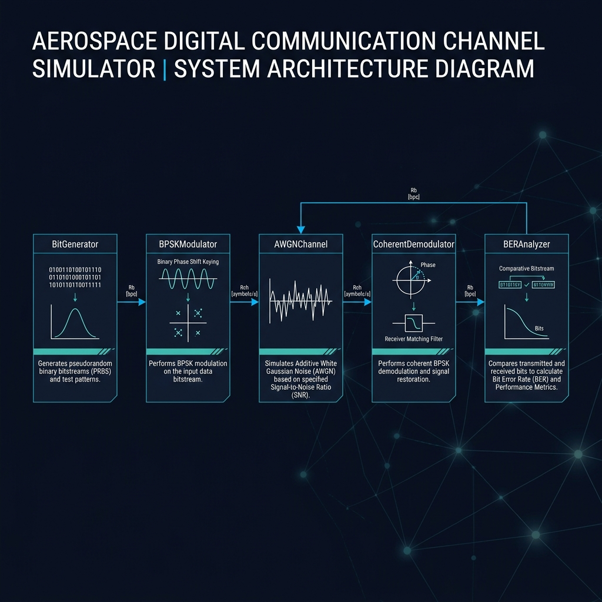
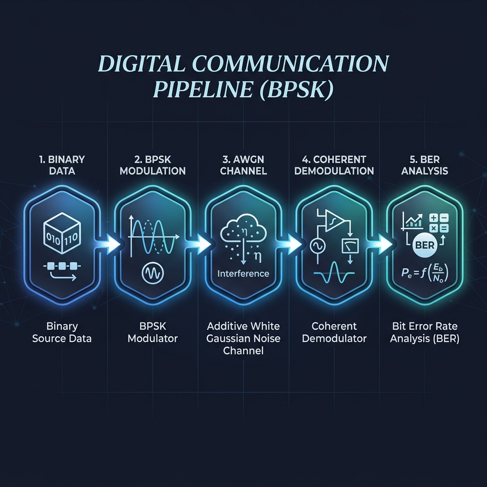
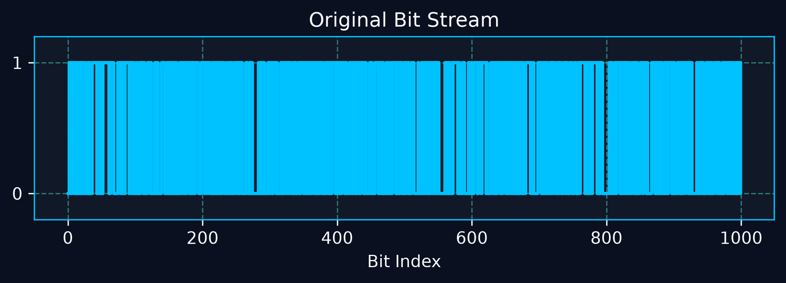
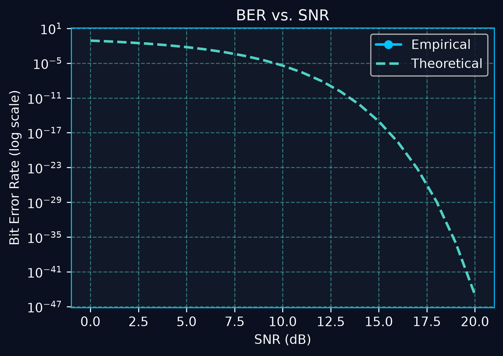
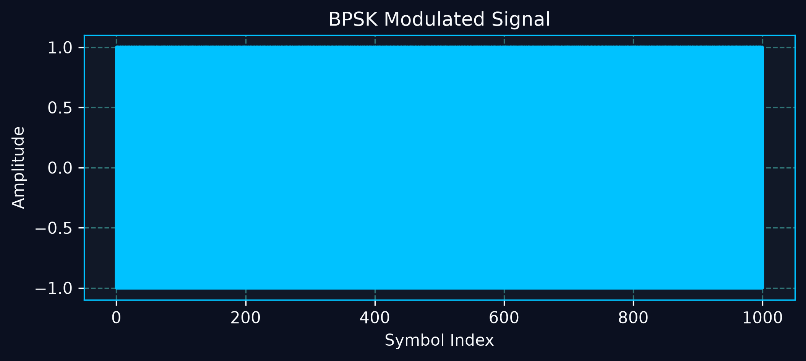
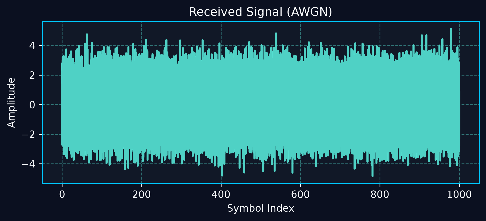
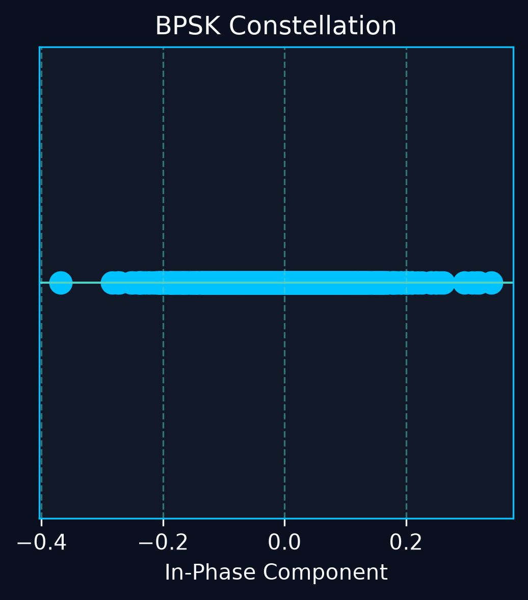

# 📡 Digital Communication Channel Simulator

> **Abstract**
> This repository presents a comprehensive, academically‑styled simulation of a digital communication system employing Binary Phase‑Shift Keying (BPSK) modulation over an Additive White Gaussian Noise (AWGN) channel. The simulator integrates theoretical analysis—deriving closed‑form Bit Error Rate (BER) expressions—with Monte‑Carlo experiments, offering an interactive platform for exploring fundamental concepts in modern communication theory and signal processing. Implemented in Python with a Streamlit front‑end, the tool serves both pedagogical demonstrations and rapid prototyping of communication link models.


---

## 🎯 Project Overview

The **Digital Communication Channel Simulator** is an interactive, web‑based application that models a complete digital communication chain using Binary Phase‑Shift Keying (BPSK) over an Additive White Gaussian Noise (AWGN) channel.  It generates random binary data, modulates it, adds realistic channel noise, demodulates the received signal, and computes both *theoretical* and *empirical* Bit Error Rates (BER).  The entire workflow is visualised with slick, dark‑theme plots rendered in a Streamlit dashboard.

### Why Digital Communication Systems Matter

Digital communication underpins every modern wireless and wired technology—from satellite uplinks and 5G networks to the Internet of Things (IoT) and deep‑space probes.  Understanding how noise degrades a signal and how modulation schemes protect information is essential for:

- **Satellite communications** – ensuring reliable telemetry and payload data.
- **Wireless networks** – designing robust links for mobile and IoT devices.
- **Aerospace systems** – guaranteeing command‑and‑control integrity.
- **Deep‑space missions** – coping with extreme attenuation and radiation‑induced noise.
- **Industrial IoT** – maintaining low‑latency, high‑reliability links.

---

## 🛠️ Problem Statement

Real‑world communication links are never noise‑free.  Engineers must evaluate how modulation choices, signal power, and channel conditions affect reliability.  Two core metrics are:

1. **Signal‑to‑Noise Ratio (SNR)** – the ratio of signal power to noise power, expressed in decibels (dB).
2. **Bit Error Rate (BER)** – the probability that a transmitted bit is incorrectly received.

The simulator demonstrates the full **transmit → channel → receive** pipeline, allowing users to explore the impact of SNR on BER through Monte‑Carlo simulations.

---

## 📚 Communication Theory

| Concept | Explanation |
|---------|-------------|
| **Binary Data Transmission** | Information is represented as a sequence of bits (0 or 1). |
| **BPSK Modulation** | Each bit maps to a phase: `0 → +1` and `1 → -1`. The transmitted waveform is `s(t) = A·cos(2πf_ct + φ)` with φ = 0 or π. |
| **AWGN Channel** | Noise `n(t) ∼ 𝒩(0, σ²)` is added to the signal. The noise variance is linked to SNR: `σ² = A² / (2·10^{SNR/10})`. |
| **Signal‑to‑Noise Ratio (SNR)** | `SNR_{dB} = 10·log₁₀(P_signal / P_noise)`. Higher SNR → cleaner reception. |
| **Bit Error Rate (BER)** | For BPSK over AWGN the closed‑form BER is `BER_theoretical = 0.5·erfc(√(SNR_linear))`. |
| **Constellation Diagram** | A 2‑D plot of the received symbol’s in‑phase (I) and quadrature (Q) components. For BPSK the points collapse onto the I‑axis. |
| **Monte Carlo Simulation** | Repeatedly generate random bits, pass them through the chain, and empirically estimate BER as `BER_empirical = errors / N_bits`. |

---

## 🏛️ System Architecture



| Block | Inputs | Outputs | Purpose |
|-------|--------|---------|---------|
| **Bit Generator** | `num_bits` | Binary array `bits_tx` | Creates a random bit stream for the simulation. |
| **BPSK Modulator** | `bits_tx`, `samples_per_symbol` | Waveform `s(t)` | Maps bits to ±1 symbols and oversamples for smooth plotting. |
| **AWGN Channel** | Modulated signal, `SNR_dB` | Noisy signal `r(t)` | Adds Gaussian noise proportional to the supplied SNR. |
| **Coherent Demodulator** | Noisy signal, `samples_per_symbol` | Recovered bits `bits_rx` | Performs matched‑filter sampling and decision making. |
| **BER Analyzer** | `bits_tx`, `bits_rx` | Empirical BER, Theoretical BER | Computes error statistics and aggregates across Monte‑Carlo runs. |
| **Visualization Layer** | All intermediate data | Plots & dashboard widgets | Renders bit streams, waveforms, constellation, and BER curves. |

---

## 🔄 Communication Pipeline



```
Binary Data → BPSK Modulation → AWGN Channel → Coherent Demodulation → BER Analysis
```

Each arrow represents a deterministic transformation or stochastic process, enabling end‑to‑end performance evaluation.

---

## 🌟 Features

| Feature | Description |
|---------|-------------|
| **Binary Bit Generator** | Fast NumPy‑based random bit creation. |
| **BPSK Modulator** | Oversampled waveform generation with configurable samples per symbol. |
| **AWGN Channel Simulator** | Precise noise variance calculation from user‑specified SNR. |
| **BER Analyzer** | Monte‑Carlo averaging, theoretical BER computation, and CSV export. |
| **Constellation Visualizer** | 2‑D scatter plot of received symbols. |
| **Streamlit Dashboard** | Dark‑theme, responsive UI with real‑time progress spinner. |
| **CSV Export** | Downloadable results for further analysis. |
| **Theory Section** | In‑dashboard explanation of modulation, SNR, and BER. |
| **Performance Optimisation** | Thread‑based parallel simulation for large Monte‑Carlo runs. |

---

## 📦 Usage Guide

### 1️⃣ Installation
```bash
# Clone the repository
git clone https://github.com/AarjuAgrahari/Digital-Communication-Simulator.git
cd Digital-Communication-Simulator
```

### 2️⃣ Virtual Environment (recommended)
```bash
python -m venv .venv
# Windows
.venv\Scripts\activate
# macOS / Linux
source .venv/bin/activate
```

### 3️⃣ Dependency Installation
```bash
pip install -r requirements.txt
```
> *Tip:* The project uses `numpy`, `pandas`, `matplotlib`, and `streamlit`.

### 4️⃣ Running the Dashboard
```bash
streamlit run app.py
```
Open the URL printed in the console (usually `http://localhost:8501`).

### 5️⃣ Using the Dashboard
1. Select the **Number of bits** (e.g., 1000).
2. Set the **SNR range** (start, end, step).
3. Choose **Monte‑Carlo runs per SNR**.
4. (Optional) Enable **multiprocessing** for large runs.
5. Click **Run Simulation**.

### 6️⃣ Generating Results
- Plots are displayed automatically.
- The **⬇️ Download Results CSV** button saves `ber_results.csv` to your `results/` folder.
- All generated images are stored under `plots/` for archival.

---

## 🧭 Example Workflow
1. **Generate 1000 bits** – default selection in the sidebar.
2. **Select SNR range** – 0 dB to 20 dB, step 2 dB.
3. **Run Simulation** – press the button and watch the spinner.
4. **Observe BER** – empirical points overlay the theoretical curve.
5. **Compare** – note how BER drops dramatically after ~10 dB.
6. **Export** – click “Download Results CSV” and open the file in Excel or Python.

---

## 📸 Screenshots
| Caption | Image |
|---------|-------|
| **Bit_Stream** |  |
| **BER Curve Result** |  |
| **BPSK Modulation** |  | 
| **Noisy Signal** |  |
| **Constellation Diagram** |  |

*All images are stored in the `assets/` directory.*

---

## 🧩 Engineering Concepts Covered
- Digital Communications
- Modulation & Demodulation
- AWGN Channel Modeling
- Signal Processing & Oversampling
- Probability & Statistics (Monte‑Carlo)
- Performance Optimization (ThreadPoolExecutor)
- Scientific Visualization (Matplotlib + Streamlit)
- Python / Package Development

---

## 📄 Resume Relevance
**What This Project Demonstrates**
- Solid grasp of communication theory and practical simulation.
- Ability to build end‑to‑end engineering pipelines in Python.
- Experience with data analysis, CSV handling, and reproducible visualisation.
- UI/UX design for scientific dashboards using Streamlit.
- Performance‑aware programming (parallel execution, caching).
- Clear documentation and professional repository presentation.

---

## 🚀 Future Enhancements
- **Higher‑order Modulation** – QPSK, 16‑QAM, 64‑QAM.
- **OFDM** – Multi‑carrier transmission.
- **Channel Coding** – Convolutional / LDPC codes.
- **MIMO** – Spatial multiplexing and diversity.
- **Satellite Link Budget** – Free‑space path loss, Doppler shift.
- **Interactive Theory Section** – Expandable math with LaTeX.
- **Automated Testing** – Unit tests for each module.

---

## 👨‍💻 Author
**Aarju Shaw**
- B.Tech, Electronics & Communication Engineering (Data Science)
- Research Interests: Communication Systems, Space Technology, AI for Engineering, Satellite Networks

---

*Feel free to fork, open issues, or submit pull requests!*
